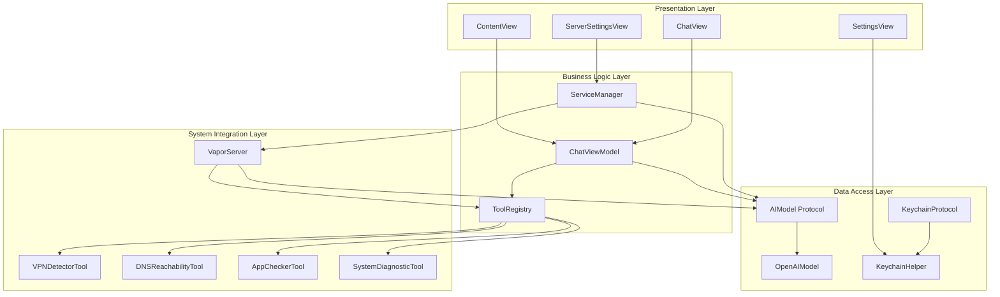
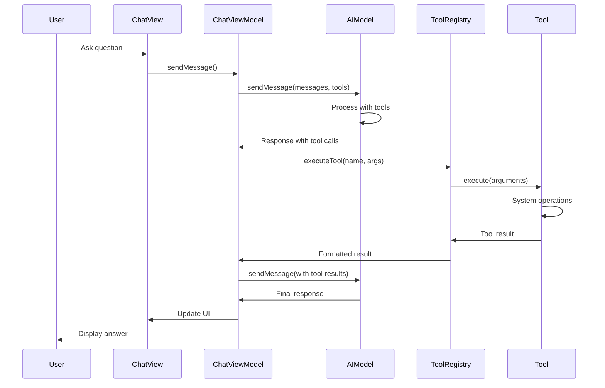
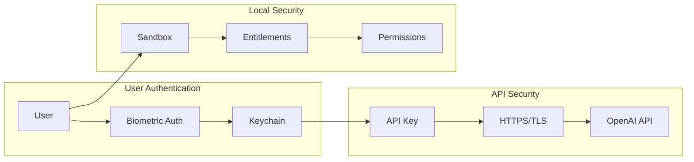

# 🏗️ Architecture Documentation

This document provides a comprehensive overview of the Breadcrumbs application architecture, including system design, component interactions, and data flow patterns.

## 📐 System Architecture

Breadcrumbs follows a layered architecture pattern with clear separation of concerns:

### Architecture Layers

1. **Presentation Layer** (SwiftUI Views)
2. **Business Logic Layer** (ViewModels & Services)
3. **Data Access Layer** (Protocols & Implementations)
4. **System Integration Layer** (Tools & External APIs)

## 🔄 Data Flow Architecture

The application follows a unidirectional data flow pattern:

```
User Input → ViewModel → AI Model → Tool Registry → System Tools
     ↓           ↓          ↓           ↓            ↓
UI Updates ← ChatView ← ChatMessage ← Tool Results ← System Data
```

## 🧩 Component Architecture

### Core Components

- **App Entry Point**: `breadcrumbsApp.swift`
- **Main Interface**: `ContentView.swift`
- **Chat Interface**: `ChatView.swift` + `ChatViewModel.swift`
- **AI Integration**: `OpenAIModel.swift` (implements `AIModel`)
- **Tool System**: `ToolRegistry.swift` + Tool implementations
- **Security**: `KeychainHelper.swift` (implements `KeychainProtocol`)
- **Server**: `VaporServer.swift`

### Protocol-Based Design

The application uses protocol-oriented programming for flexibility and testability:

- **`AIModel`**: Abstract AI provider interface
- **`AITool`**: Diagnostic tool interface
- **`KeychainProtocol`**: Secure storage interface

## 🔧 Tool System Architecture

### Tool Registration

Tools are registered in the `ToolRegistry` and follow a consistent interface:

```swift
protocol AITool: Sendable {
    var name: String { get }
    var description: String { get }
    var parametersSchema: ToolParameterSchema { get }
    func execute(arguments: [String: Any]) async throws -> String
}
```

### Tool Execution Flow

1. AI model requests tool execution
2. ToolRegistry validates and routes the request
3. Tool implementation executes system operations
4. Results are formatted and returned to AI
5. AI processes results and provides user response

## 🌐 Server Architecture

### HTTP API Design

The Vapor server provides RESTful endpoints:

- **`GET /api/v1/health`**: Health check
- **`GET /api/v1/tools`**: Available tools list
- **`POST /api/v1/chat`**: Chat completion with tool support

### Middleware Stack

1. **CORS Middleware**: Cross-origin request handling
2. **API Key Middleware**: Bearer token authentication
3. **Error Middleware**: Global error handling

## 🔐 Security Architecture

### Authentication Flow

1. User provides API key in Settings
2. Key stored in Keychain with biometric protection
3. App requests biometric authentication on access
4. API key retrieved and used for OpenAI requests

### Data Protection

- **Local Processing**: All diagnostics run locally
- **Secure Storage**: Keychain with biometric protection
- **No Persistence**: Diagnostic results not stored
- **HTTPS Only**: All external communications encrypted

## 📊 State Management

### SwiftUI State

- **`@StateObject`**: ViewModels for business logic
- **`@Published`**: Observable properties for UI updates
- **`@State`**: Local view state

### Data Models

- **`ChatMessage`**: Conversation messages
- **`ToolCall`**: AI tool execution requests
- **`ToolResult`**: Tool execution results

## 🔄 Async/Await Patterns

The application uses modern Swift concurrency:

- **Async Tool Execution**: All tools run asynchronously
- **Streaming Support**: Optional streaming for AI responses
- **Main Actor**: UI updates on main thread
- **Task Management**: Proper task cancellation and cleanup

## 🧪 Testing Architecture

### Test Structure

- **Unit Tests**: Individual component testing
- **Integration Tests**: Component interaction testing
- **Mock Objects**: Protocol-based mocking
- **Test Helpers**: Utility functions for testing

### Mock Implementations

- **`MockAIModel`**: AI model for testing
- **`MockAITool`**: Tool implementations for testing
- **`MockKeychainHelper`**: Keychain operations for testing

## 📈 Performance Considerations

### Optimization Strategies

- **Lazy Loading**: Views and data loaded on demand
- **Caching**: Message groups cached for performance
- **Background Processing**: Tool execution on background threads
- **Memory Management**: Proper cleanup and weak references

### Scalability

- **Protocol-Based**: Easy to add new AI providers
- **Tool Registry**: Dynamic tool registration
- **Modular Design**: Components can be extended independently
- **Server Architecture**: Horizontal scaling possible

## 🔮 Future Architecture Considerations

### Extensibility

- **Plugin System**: Dynamic tool loading
- **Multiple AI Providers**: Anthropic, Google, etc.
- **Custom Tools**: User-defined diagnostic tools
- **Cloud Integration**: Optional cloud storage

### Performance Improvements

- **Tool Caching**: Cache tool results
- **Streaming UI**: Real-time tool execution updates
- **Background Sync**: Periodic system health checks
- **Analytics**: Usage and performance metrics

## 🏗️ Detailed Component Diagrams

### System Architecture Overview



### Tool Execution Flow



### Security Architecture



## 🔧 Configuration Architecture

### Build Configuration

The application supports multiple build configurations:

- **Debug**: Development with verbose logging
- **Release**: Optimized production build
- **Testing**: Unit test configuration

### Environment Management

- **API Keys**: Stored securely in Keychain
- **Server Configuration**: Configurable port and API key
- **Tool Configuration**: Dynamic tool registration
- **Logging**: Configurable log levels and categories

## 📱 Platform Integration

### macOS APIs Used

- **NetworkExtension**: VPN detection and management
- **SystemConfiguration**: Network configuration access
- **Security**: Keychain operations
- **LocalAuthentication**: Biometric authentication
- **AppKit**: Application information and system integration

### Entitlements

The application requires specific entitlements for system access:

```xml
<!-- Network access for API calls and server -->
<key>com.apple.security.network.client</key>
<true/>
<key>com.apple.security.network.server</key>
<true/>

<!-- System configuration access -->
<key>com.apple.security.files.user-selected.read-only</key>
<true/>

<!-- Disable sandbox for system diagnostics -->
<key>com.apple.security.app-sandbox</key>
<false/>
```

## 🚀 Deployment Architecture

### Application Distribution

- **App Store**: Notarized and sandboxed version
- **Direct Distribution**: Full system access version
- **Developer Builds**: Debug and development versions

### Server Deployment

- **Local Development**: Localhost server for testing
- **Production**: Configurable port and authentication
- **Docker**: Containerized deployment option
- **System Service**: LaunchDaemon integration

## 📊 Monitoring and Observability

### Logging Strategy

- **Structured Logging**: OSLog with categories
- **Log Levels**: Debug, Info, Error
- **Categories**: General, Chat, Tools, UI, Server
- **Performance**: Minimal impact logging

### Error Handling

- **Graceful Degradation**: Fallback mechanisms
- **User Feedback**: Clear error messages
- **Recovery**: Automatic retry mechanisms
- **Reporting**: Error aggregation and analysis

## 🔄 Data Flow Patterns

### Unidirectional Data Flow

```
User Action → ViewModel → Service → Tool → System
     ↓            ↓         ↓        ↓        ↓
UI Update ← State Change ← Result ← Data ← Response
```

### State Management

- **Single Source of Truth**: ViewModels manage state
- **Immutable Updates**: State changes through methods
- **Reactive Updates**: SwiftUI automatic UI updates
- **State Persistence**: Minimal state persistence

## 🧪 Testing Strategy

### Test Pyramid

1. **Unit Tests**: Individual component testing
2. **Integration Tests**: Component interaction testing
3. **UI Tests**: End-to-end user workflow testing
4. **Performance Tests**: Load and stress testing

### Mock Strategy

- **Protocol-Based**: Easy mocking through protocols
- **Dependency Injection**: Testable component design
- **Mock Factories**: Centralized mock creation
- **Test Doubles**: Stubs, mocks, and fakes

## 📈 Scalability Considerations

### Horizontal Scaling

- **Stateless Design**: No server-side state
- **Load Balancing**: Multiple server instances
- **Tool Distribution**: Distributed tool execution
- **Caching**: Result caching strategies

### Vertical Scaling

- **Memory Management**: Efficient memory usage
- **CPU Optimization**: Background processing
- **I/O Optimization**: Async operations
- **Resource Pooling**: Connection pooling

## 🔮 Future Enhancements

### Microservices Architecture

- **Tool Services**: Individual tool microservices
- **API Gateway**: Centralized API management
- **Service Discovery**: Dynamic service registration
- **Health Monitoring**: Service health checks

### Event-Driven Architecture

- **Event Sourcing**: State change events
- **CQRS**: Command Query Responsibility Segregation
- **Message Queues**: Asynchronous processing
- **Event Streaming**: Real-time updates

---

This architecture provides a solid foundation for the Breadcrumbs application while maintaining flexibility for future enhancements and scalability requirements.
