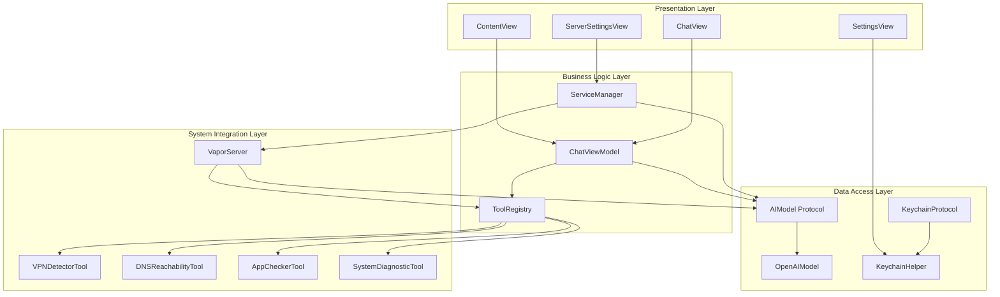
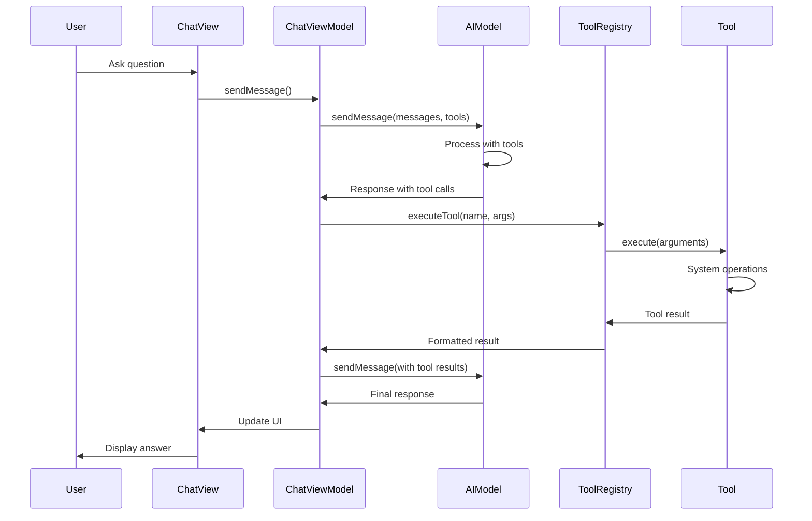
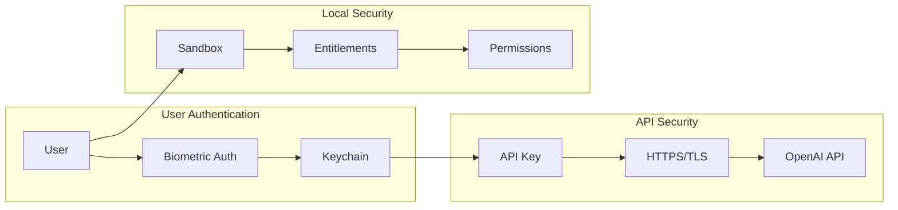
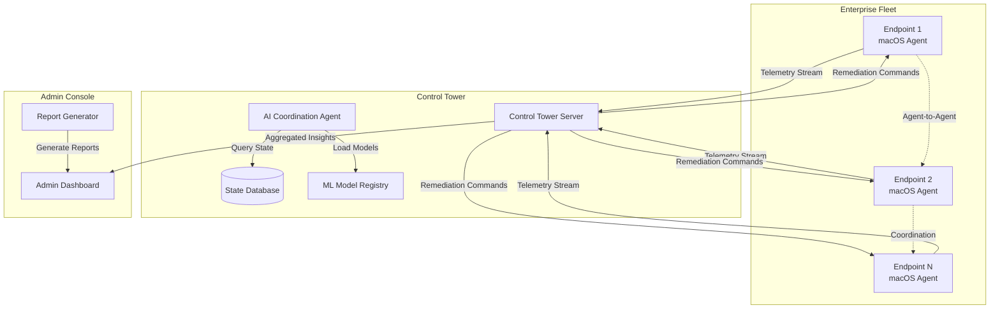

# 🏗️ Architecture Documentation

This document provides a comprehensive overview of the Breadcrumbs application architecture, including system design, component interactions, and data flow patterns.

## 📐 System Architecture

Breadcrumbs follows a layered architecture pattern with clear separation of concerns:

### Architecture Layers

1. **Presentation Layer** (SwiftUI Views)
2. **Business Logic Layer** (ViewModels & Services)
3. **Data Access Layer** (Protocols & Implementations)
4. **System Integration Layer** (Tools & External APIs)

## 🔄 Data Flow Architecture

The application follows a unidirectional data flow pattern:

```
User Input → ViewModel → AI Model → Tool Registry → System Tools
     ↓           ↓          ↓           ↓            ↓
UI Updates ← ChatView ← ChatMessage ← Tool Results ← System Data
```

## 🧩 Component Architecture

### Core Components

- **App Entry Point**: `breadcrumbsApp.swift`
- **Main Interface**: `ContentView.swift`
- **Chat Interface**: `ChatView.swift` + `ChatViewModel.swift`
- **AI Integration**: `OpenAIModel.swift` (implements `AIModel`)
- **Tool System**: `ToolRegistry.swift` + Tool implementations
- **Security**: `KeychainHelper.swift` (implements `KeychainProtocol`)
- **Server**: `VaporServer.swift`

### Protocol-Based Design

The application uses protocol-oriented programming for flexibility and testability:

- **`AIModel`**: Abstract AI provider interface
- **`AITool`**: Diagnostic tool interface
- **`KeychainProtocol`**: Secure storage interface

## 🔧 Tool System Architecture

### Tool Registration

Tools are registered in the `ToolRegistry` and follow a consistent interface:

```swift
protocol AITool: Sendable {
    var name: String { get }
    var description: String { get }
    var parametersSchema: ToolParameterSchema { get }
    func execute(arguments: [String: Any]) async throws -> String
}
```

### Tool Execution Flow

1. AI model requests tool execution
2. ToolRegistry validates and routes the request
3. Tool implementation executes system operations
4. Results are formatted and returned to AI
5. AI processes results and provides user response

## 🌐 Server Architecture

### HTTP API Design

The Vapor server provides RESTful endpoints:

- **`GET /api/v1/health`**: Health check
- **`GET /api/v1/tools`**: Available tools list
- **`POST /api/v1/chat`**: Chat completion with tool support

### Middleware Stack

1. **CORS Middleware**: Cross-origin request handling
2. **API Key Middleware**: Bearer token authentication
3. **Error Middleware**: Global error handling

## 🔐 Security Architecture

### Authentication Flow

1. User provides API key in Settings
2. Key stored in Keychain with biometric protection
3. App requests biometric authentication on access
4. API key retrieved and used for OpenAI requests

### Data Protection

- **Local Processing**: All diagnostics run locally
- **Secure Storage**: Keychain with biometric protection
- **No Persistence**: Diagnostic results not stored
- **HTTPS Only**: All external communications encrypted

## 📊 State Management

### SwiftUI State

- **`@StateObject`**: ViewModels for business logic
- **`@Published`**: Observable properties for UI updates
- **`@State`**: Local view state

### Data Models

- **`ChatMessage`**: Conversation messages
- **`ToolCall`**: AI tool execution requests
- **`ToolResult`**: Tool execution results

## 🔄 Async/Await Patterns

The application uses modern Swift concurrency:

- **Async Tool Execution**: All tools run asynchronously
- **Streaming Support**: Optional streaming for AI responses
- **Main Actor**: UI updates on main thread
- **Task Management**: Proper task cancellation and cleanup

## 🧪 Testing Architecture

### Test Structure

- **Unit Tests**: Individual component testing
- **Integration Tests**: Component interaction testing
- **Mock Objects**: Protocol-based mocking
- **Test Helpers**: Utility functions for testing

### Mock Implementations

- **`MockAIModel`**: AI model for testing
- **`MockAITool`**: Tool implementations for testing
- **`MockKeychainHelper`**: Keychain operations for testing

## 📈 Performance Considerations

### Optimization Strategies

- **Lazy Loading**: Views and data loaded on demand
- **Caching**: Message groups cached for performance
- **Background Processing**: Tool execution on background threads
- **Memory Management**: Proper cleanup and weak references

### Scalability

- **Protocol-Based**: Easy to add new AI providers
- **Tool Registry**: Dynamic tool registration
- **Modular Design**: Components can be extended independently
- **Server Architecture**: Horizontal scaling possible

## 🔮 Future Architecture Considerations

### Extensibility

- **Plugin System**: Dynamic tool loading
- **Multiple AI Providers**: Anthropic, Google, etc.
- **Custom Tools**: User-defined diagnostic tools
- **Cloud Integration**: Optional cloud storage

### Performance Improvements

- **Tool Caching**: Cache tool results
- **Streaming UI**: Real-time tool execution updates
- **Background Sync**: Periodic system health checks
- **Analytics**: Usage and performance metrics

## 🏗️ Detailed Component Diagrams

### System Architecture Overview



### Tool Execution Flow



### Security Architecture



## 🔧 Configuration Architecture

### Build Configuration

The application supports multiple build configurations:

- **Debug**: Development with verbose logging
- **Release**: Optimized production build
- **Testing**: Unit test configuration

### Environment Management

- **API Keys**: Stored securely in Keychain
- **Server Configuration**: Configurable port and API key
- **Tool Configuration**: Dynamic tool registration
- **Logging**: Configurable log levels and categories

## 📱 Platform Integration

### macOS APIs Used

- **NetworkExtension**: VPN detection and management
- **SystemConfiguration**: Network configuration access
- **Security**: Keychain operations
- **LocalAuthentication**: Biometric authentication
- **AppKit**: Application information and system integration

### Entitlements

The application requires specific entitlements for system access:

```xml
<!-- Network access for API calls and server -->
<key>com.apple.security.network.client</key>
<true/>
<key>com.apple.security.network.server</key>
<true/>

<!-- System configuration access -->
<key>com.apple.security.files.user-selected.read-only</key>
<true/>

<!-- Disable sandbox for system diagnostics -->
<key>com.apple.security.app-sandbox</key>
<false/>
```

## 🚀 Deployment Architecture

### Application Distribution

- **App Store**: Notarized and sandboxed version
- **Direct Distribution**: Full system access version
- **Developer Builds**: Debug and development versions

### Server Deployment

- **Local Development**: Localhost server for testing
- **Production**: Configurable port and authentication
- **Docker**: Containerized deployment option
- **System Service**: LaunchDaemon integration

## 📊 Monitoring and Observability

### Logging Strategy

- **Structured Logging**: OSLog with categories
- **Log Levels**: Debug, Info, Error
- **Categories**: General, Chat, Tools, UI, Server
- **Performance**: Minimal impact logging

### Error Handling

- **Graceful Degradation**: Fallback mechanisms
- **User Feedback**: Clear error messages
- **Recovery**: Automatic retry mechanisms
- **Reporting**: Error aggregation and analysis

## 🔄 Data Flow Patterns

### Unidirectional Data Flow

```
User Action → ViewModel → Service → Tool → System
     ↓            ↓         ↓        ↓        ↓
UI Update ← State Change ← Result ← Data ← Response
```

### State Management

- **Single Source of Truth**: ViewModels manage state
- **Immutable Updates**: State changes through methods
- **Reactive Updates**: SwiftUI automatic UI updates
- **State Persistence**: Minimal state persistence

## 🧪 Testing Strategy

### Test Pyramid

1. **Unit Tests**: Individual component testing
2. **Integration Tests**: Component interaction testing
3. **UI Tests**: End-to-end user workflow testing
4. **Performance Tests**: Load and stress testing

### Mock Strategy

- **Protocol-Based**: Easy mocking through protocols
- **Dependency Injection**: Testable component design
- **Mock Factories**: Centralized mock creation
- **Test Doubles**: Stubs, mocks, and fakes

## 📈 Scalability Considerations

### Horizontal Scaling

- **Stateless Design**: No server-side state
- **Load Balancing**: Multiple server instances
- **Tool Distribution**: Distributed tool execution
- **Caching**: Result caching strategies

### Vertical Scaling

- **Memory Management**: Efficient memory usage
- **CPU Optimization**: Background processing
- **I/O Optimization**: Async operations
- **Resource Pooling**: Connection pooling

## 🔮 Future Enhancements

### Microservices Architecture

- **Tool Services**: Individual tool microservices
- **API Gateway**: Centralized API management
- **Service Discovery**: Dynamic service registration
- **Health Monitoring**: Service health checks

### Event-Driven Architecture

- **Event Sourcing**: State change events
- **CQRS**: Command Query Responsibility Segregation
- **Message Queues**: Asynchronous processing
- **Event Streaming**: Real-time updates

## 🎯 POC-to-Vision Architecture Evolution

### Current POC Architecture (What Exists)

The current implementation demonstrates a **client-side endpoint agent** with these key components:

#### 🔵 Implemented Components

**1. Tool Execution Layer** ([AITool.swift:36-68](breadcrumbs/Protocols/AITool.swift#L36-L68))
- Protocol-based tool interface (`AITool`)
- Dynamic tool registry (`ToolRegistry`)
- Four production tools: VPN detection, DNS reachability, app monitoring, system diagnostics
- JSON Schema parameter validation
- Async execution model

**2. AI Integration Layer** ([OpenAIModel.swift:13-96](breadcrumbs/Models/OpenAIModel.swift#L13-L96))
- `AIModel` protocol abstracts AI provider
- OpenAI implementation with function calling
- Tool-augmented chat completions
- Structured message handling

**3. HTTP API Layer** ([VaporServer.swift:14-150](breadcrumbs/Services/VaporServer.swift#L14-L150))
- Vapor-based REST API
- Bearer token authentication
- Three endpoints: health, tools list, chat
- CORS support for external access

**4. Local Intelligence** ([ChatViewModel.swift:13-150](breadcrumbs/ViewModels/ChatViewModel.swift#L13-L150))
- Conversation management
- Tool call orchestration
- Error handling and retry logic
- System prompt configuration

#### 🏗️ Architectural Foundation for Vision

**Protocol-Oriented Design Enables Extension**
- `AIModel` protocol allows swapping AI providers (OpenAI → local models → federated)
- `AITool` protocol supports dynamic tool loading
- `ToolInput`/`ToolOutput` provide structured data contracts

**REST API as Agent Communication Foundation**
- Current HTTP endpoints ([API.md:56-188](API.md#L56-L188)) demonstrate endpoint-to-server communication
- JSON-based messaging supports rich context exchange
- Bearer auth model extends to mutual agent authentication

**Async/Await Concurrency Primitives**
- All tools use `async throws` for non-blocking execution
- Enables future streaming telemetry
- Supports background monitoring tasks

### Vision Architecture (Distributed Self-Healing System)

#### 🟣 Full System Components



#### 🔄 POC Component Evolution

**1. Tool System → Autonomous Action Framework**

| POC State | Evolution Path | Vision State |
|-----------|----------------|--------------|
| 🔵 Manual tool invocation via AI | 🟢 Add action history + rollback | 🟣 Predictive actions with auto-rollback |
| 🔵 Synchronous execution | 🟡 Add async monitoring tasks | 🟣 Continuous background diagnostics |
| 🔵 Four diagnostic tools | 🟢 Add 10+ remediation actions | 🟣 Custom actions + learned behaviors |

**Technical Bridge:**
- Current: `AITool.execute()` returns `String` result
- Next: Return structured `ActionResult` with success/failure state
- Vision: `RemediationAction` protocol with `validate()`, `execute()`, `rollback()`

**Code Evolution Example:**
```swift
// POC (breadcrumbs/Protocols/AITool.swift:64-67)
func execute(arguments: [String: Any]) async throws -> String

// Phase 2: Structured Results
func execute(arguments: [String: Any]) async throws -> ActionResult {
    return ActionResult(
        success: true,
        data: diagnosticData,
        rollback: { /* undo logic */ }
    )
}

// Vision: Full Remediation
protocol RemediationAction: AITool {
    func validate() async -> ValidationResult
    func execute(arguments: [String: Any]) async throws -> RemediationResult
    func rollback(result: RemediationResult) async throws
    var riskLevel: RiskLevel { get }
}
```

**2. REST API → Agent Communication Protocol**

| POC State | Evolution Path | Vision State |
|-----------|----------------|--------------|
| 🔵 HTTP REST endpoints | 🟢 Add WebSocket streaming | 🟣 Bidirectional event stream |
| 🔵 Request/response pattern | 🟡 Add server-initiated commands | 🟣 Publish/subscribe model |
| 🔵 Bearer token auth | 🟢 Add mutual TLS | 🟣 Agent trust network |

**Technical Bridge:**
- Current: `POST /api/v1/chat` endpoint ([VaporServer.swift:150](breadcrumbs/Services/VaporServer.swift#L150))
- Next: Add `WS /api/v1/stream` for real-time telemetry
- Vision: Agent protocol with semantic message types

**Evolution Path:**
```swift
// POC: Simple REST endpoint
app.post("api", "v1", "chat") { req -> ChatResponse in
    let chatRequest = try req.content.decode(ChatRequest.self)
    // Execute tools synchronously
    return ChatResponse(...)
}

// Phase 2: WebSocket Streaming
app.webSocket("api", "v1", "stream") { req, ws in
    // Stream telemetry events
    for await event in systemMonitor.events {
        try await ws.send(event.json)
    }
}

// Vision: Agent Protocol
class AgentProtocol {
    enum MessageType {
        case telemetry(TelemetryEvent)
        case remediationRequest(RemediationAction)
        case stateSync(SystemState)
        case escalation(EscalationRequest)
    }

    func sendMessage(_ message: MessageType) async throws
    func handleIncoming(_ message: MessageType) async throws
}
```

**3. Local AI → Distributed Intelligence**

| POC State | Evolution Path | Vision State |
|-----------|----------------|--------------|
| 🔵 OpenAI API for decisions | 🟢 Add on-device Core ML | 🟣 Federated learning |
| 🔵 Stateless requests | 🟡 Local decision cache | 🟣 Shared knowledge graph |
| 🔵 Single AI interaction | 🟢 Multi-turn diagnostics | 🟣 Multi-agent collaboration |

**Technical Bridge:**
- Current: `AIModel` protocol ([breadcrumbs/Protocols/AIModel.swift](breadcrumbs/Protocols/AIModel.swift))
- Next: Add `LocalInferenceModel` conforming to `AIModel`
- Vision: `FederatedAgent` with local + remote intelligence

**Architecture Evolution:**
```swift
// POC: Single AI model
protocol AIModel {
    func sendMessage(messages: [ChatMessage], tools: [AITool]?) async throws -> ChatMessage
}

// Phase 2: Hybrid Intelligence
class HybridAIModel: AIModel {
    let localModel: CoreMLModel  // Fast, on-device
    let remoteModel: OpenAIModel // Powerful, cloud

    func sendMessage(...) async throws -> ChatMessage {
        // Route based on complexity
        if canHandleLocally(messages) {
            return try await localModel.infer(messages)
        } else {
            return try await remoteModel.sendMessage(messages)
        }
    }
}

// Vision: Collaborative Agent
class CollaborativeAgent: AIModel {
    let localIntelligence: LocalAgent
    let controlTowerAgent: RemoteAgent
    let peerAgents: [PeerAgent]

    func diagnose(problem: Problem) async throws -> Solution {
        // Try local resolution first
        if let solution = try await localIntelligence.solve(problem) {
            return solution
        }

        // Consult peers for similar issues
        if let peerSolution = try await consultPeers(problem) {
            localIntelligence.learn(problem, solution: peerSolution)
            return peerSolution
        }

        // Escalate to control tower
        return try await controlTowerAgent.escalate(problem)
    }
}
```

**4. Data Collection → Predictive Telemetry**

| POC State | Evolution Path | Vision State |
|-----------|----------------|--------------|
| 🔵 On-demand diagnostics | 🟢 Periodic health checks | 🟣 Continuous monitoring |
| 🔵 Manual tool execution | 🟡 Scheduled scans | 🟣 Anomaly-triggered collection |
| 🔵 Unstructured output | 🟢 Structured metrics | 🟣 Time-series with ML features |

**Technical Bridge:**
- Current: Tools return formatted strings ([VPNDetectorTool.swift:51-97](breadcrumbs/Tools/VPNDetectorTool.swift#L51-L97))
- Next: Tools return structured `ToolOutput` with metrics
- Vision: Streaming telemetry with predictive features

**Data Model Evolution:**
```swift
// POC: String output
struct VPNDetectorOutput: ToolOutput {
    func toFormattedString() -> String {
        return "VPN Connection Status: \(isConnected ? "YES" : "NO")"
    }
}

// Phase 2: Structured Metrics
struct VPNTelemetry: Codable {
    let timestamp: Date
    let isConnected: Bool
    let metrics: VPNMetrics
    let metadata: [String: String]
}

struct VPNMetrics: Codable {
    let connectionDuration: TimeInterval
    let bytesTransferred: UInt64
    let latency: Double
    let packetLoss: Double
}

// Vision: Predictive Telemetry Stream
class TelemetryCollector {
    func startContinuousMonitoring() -> AsyncStream<TelemetryEvent> {
        AsyncStream { continuation in
            Task {
                while true {
                    // Collect metrics
                    let metrics = await collectMetrics()

                    // Extract ML features
                    let features = extractFeatures(metrics)

                    // Detect anomalies
                    if let anomaly = anomalyDetector.detect(features) {
                        continuation.yield(.anomaly(anomaly))
                    }

                    // Regular telemetry
                    continuation.yield(.metrics(metrics))

                    try await Task.sleep(for: .seconds(30))
                }
            }
        }
    }
}
```

### Detailed Evolution Roadmap

#### Phase 1: POC → Enhanced Local Intelligence (3 months)

**Objective:** Strengthen endpoint capabilities without external dependencies

**Key Enhancements:**
1. **Add 6 Remediation Tools**
   - `RestartAppAction`: Safe app restart with state preservation
   - `ClearCacheAction`: App cache clearing with rollback
   - `ResetNetworkAction`: Network stack reset
   - `VPNReconnectAction`: Intelligent VPN reconnection
   - `LogRotationAction`: Log file management
   - `ResourceCleanupAction`: Memory/disk cleanup

2. **Structured Data Models**
   - Replace string outputs with codable structures
   - Add metrics collection to all tools
   - Implement action result tracking

3. **Local Decision Engine**
   - Rule-based action selection
   - Risk assessment framework
   - Automatic rollback on failure

**Proof Points:**
- Current `ToolRegistry` ([AITool.swift:115-172](breadcrumbs/Protocols/AITool.swift#L115-L172)) demonstrates dynamic tool loading
- Protocol design allows seamless addition of new tools
- Async execution model supports background remediation

#### Phase 2: Endpoint ↔ Control Tower Communication (6 months)

**Objective:** Build bidirectional agent communication

**Key Enhancements:**
1. **WebSocket Streaming**
   - Extend `VaporServer` with WebSocket support
   - Implement event-driven updates
   - Add connection resilience

2. **Control Tower Server**
   - Vapor-based server (reuse POC patterns)
   - Fleet management dashboard
   - Aggregated diagnostics

3. **Agent Protocol**
   - Semantic message types
   - State synchronization
   - Command acknowledgment

**Proof Points:**
- Vapor integration ([VaporServer.swift](breadcrumbs/Services/VaporServer.swift)) proves Swift server viability
- Current REST API demonstrates request/response patterns
- Bearer auth extends to mutual authentication

#### Phase 3: Collaborative Intelligence (12 months)

**Objective:** Enable multi-agent problem-solving

**Key Enhancements:**
1. **Local ML Models**
   - Core ML integration
   - On-device anomaly detection
   - Classification models

2. **Peer Coordination**
   - Agent discovery protocol
   - Shared solution cache
   - Collaborative diagnosis

3. **Escalation Framework**
   - Confidence-based routing
   - Human-in-the-loop UI
   - Approval workflows

**Proof Points:**
- `AIModel` protocol abstraction supports hybrid models
- Current tool execution demonstrates complex orchestration
- Chat-based interface proves AI-human collaboration

#### Phase 4: Autonomous Self-Healing (18+ months)

**Objective:** Zero-touch problem resolution

**Key Enhancements:**
1. **Predictive Diagnostics**
   - Time-series anomaly detection
   - Failure prediction models
   - Preemptive actions

2. **Federated Learning**
   - Privacy-preserving model updates
   - Cross-fleet knowledge sharing
   - Continuous improvement

3. **Full Autonomy**
   - Automatic remediation (low-risk)
   - Approval workflows (high-risk)
   - Comprehensive audit trail

**Proof Points:**
- Async architecture enables background monitoring
- Current tool diversity demonstrates action breadth
- Protocol design supports extensibility

### Critical Technical Decisions Supporting Vision

**1. Protocol-Oriented Design**
- **POC:** `AIModel`, `AITool`, `KeychainProtocol` abstractions
- **Enables:** Easy swapping of implementations (cloud AI → local AI → hybrid)
- **Vision:** Federated agents with pluggable intelligence

**2. Async/Await Concurrency**
- **POC:** All tools use `async throws`
- **Enables:** Non-blocking operations, streaming data
- **Vision:** Real-time telemetry, background monitoring

**3. JSON Schema Validation**
- **POC:** `ToolParameterSchema` with JSON Schema ([AITool.swift:12-18](breadcrumbs/Protocols/AITool.swift#L12-L18))
- **Enables:** Runtime validation, dynamic tool registration
- **Vision:** User-defined tools, marketplace plugins

**4. Vapor Server Framework**
- **POC:** HTTP API for remote access
- **Enables:** WebSocket streaming, horizontal scaling
- **Vision:** Control tower with multi-endpoint orchestration

**5. Keychain Integration**
- **POC:** Secure credential storage ([KeychainHelper.swift](breadcrumbs/Utilities/KeychainHelper.swift))
- **Enables:** Certificate-based agent auth
- **Vision:** Zero-trust agent network

### Architectural Risks & Mitigations

**Risk 1: Endpoint Resource Constraints**
- **Challenge:** Continuous monitoring may impact battery/performance
- **Mitigation:** Adaptive monitoring (throttle based on system load)
- **POC Evidence:** Current tools are lightweight, async design prevents blocking

**Risk 2: Network Reliability**
- **Challenge:** Endpoint-to-tower communication may be intermittent
- **Mitigation:** Local caching, offline operation, sync on reconnect
- **POC Evidence:** Current API has timeout handling, error retry

**Risk 3: Security & Privacy**
- **Challenge:** Agent-to-agent communication requires trust model
- **Mitigation:** Certificate pinning, encrypted channels, audit logs
- **POC Evidence:** Bearer auth, Keychain integration demonstrate security awareness

**Risk 4: Scalability to 10K+ Endpoints**
- **Challenge:** Control tower may become bottleneck
- **Mitigation:** Horizontal scaling, edge aggregation, hierarchical architecture
- **POC Evidence:** Stateless API design, Vapor supports clustering

### Validation Strategy

**Phase 1 Validation:** Enhanced Local Intelligence
- ✅ Remediation actions execute successfully
- ✅ Rollback works on failure
- ✅ Risk assessment prevents dangerous actions
- **Timeline:** 1 sprint to implement, 2 sprints to validate

**Phase 2 Validation:** Control Tower Communication
- ✅ WebSocket streaming handles 100+ endpoints
- ✅ State synchronization stays consistent
- ✅ Network failures handled gracefully
- **Timeline:** 1 quarter to implement, 1 quarter to validate

**Phase 3 Validation:** Collaborative Intelligence
- ✅ Local ML models reduce API costs by 70%
- ✅ Peer coordination solves 50% of issues without escalation
- ✅ Escalation framework maintains human oversight
- **Timeline:** 2 quarters to implement, 1 quarter to validate

**Phase 4 Validation:** Autonomous Self-Healing
- ✅ Predictive models prevent 80% of incidents
- ✅ Zero-touch resolution for 90% of low-risk issues
- ✅ Audit trail enables compliance
- **Timeline:** 3 quarters to implement, ongoing validation

---

This architecture provides a solid foundation for the Breadcrumbs application while maintaining flexibility for future enhancements and scalability requirements. The POC demonstrates **working code** for every major component needed in the vision architecture—it's an evolutionary path, not a revolutionary redesign.
