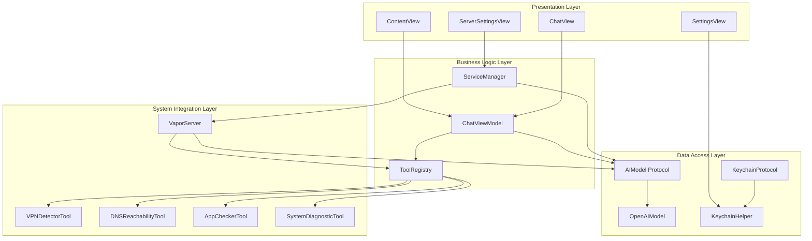
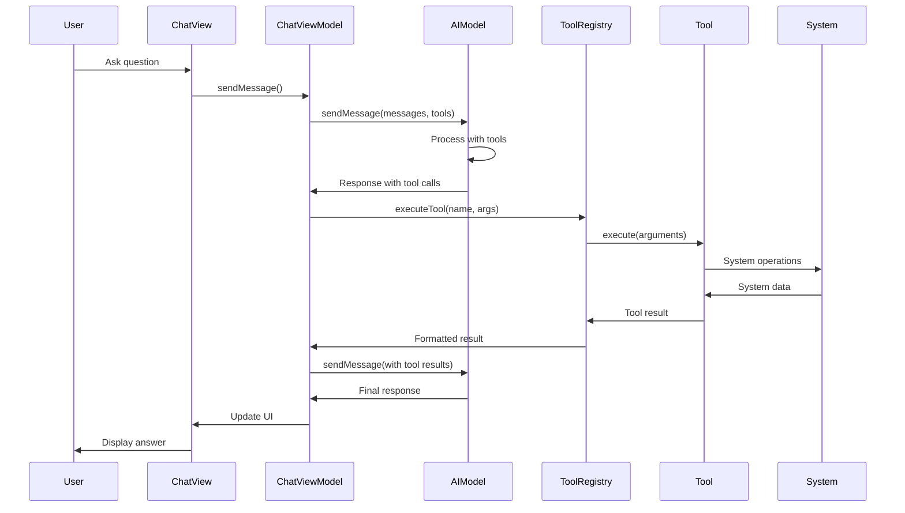
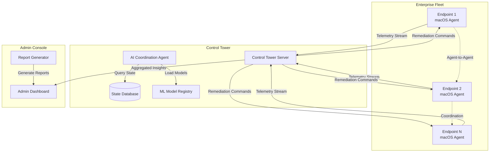
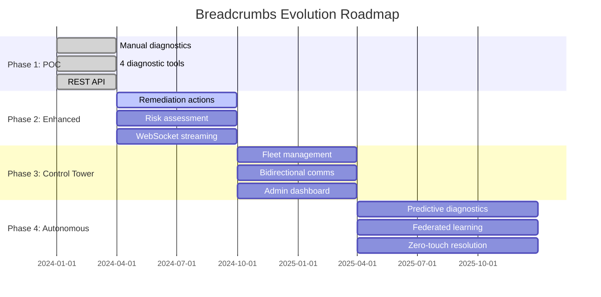
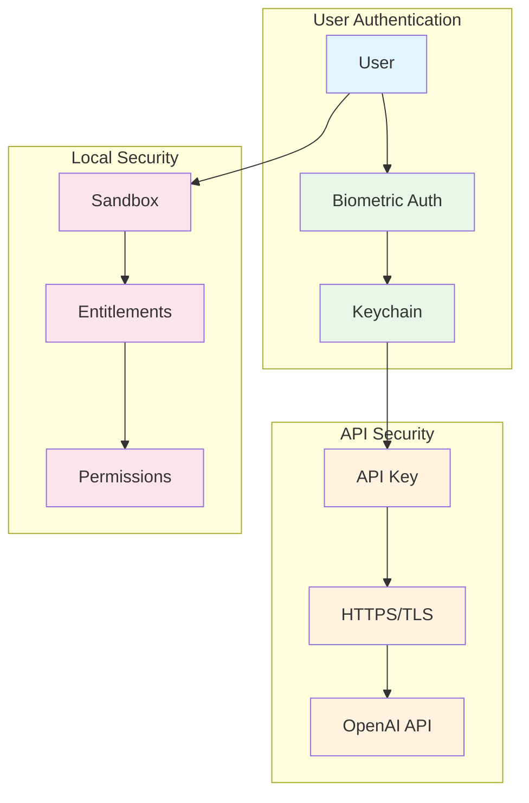
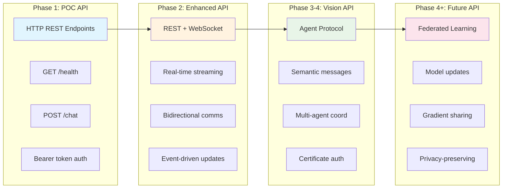
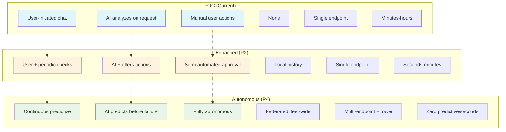
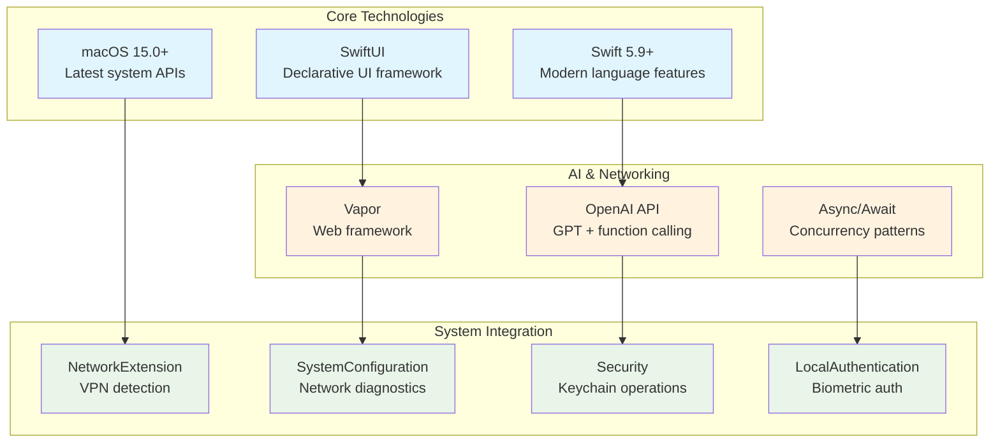

# Breadcrumbs Presentation Diagrams
## Mermaid Diagrams for Presentation

### Diagram 1: System Architecture Overview (Slide 8)
**4-Layer Architecture Design**



### Diagram 2: Tool Execution Flow (Slide 9)
**AI-Driven Diagnostic Process**



### Diagram 3: Data Flow Pattern (Slide 12)
**Unidirectional Data Flow**

```mermaid
graph LR
    UA[User Action] --> VM[ViewModel]
    VM --> S[Service]
    S --> T[Tool]
    T --> SYS[System]
    
    SYS --> DATA[Data]
    DATA --> RESULT[Result]
    RESULT --> SC[State Change]
    SC --> UI[UI Update]
    
    style UA fill:#e1f5fe
    style UI fill:#e8f5e8
    style VM fill:#fff3e0
    style S fill:#fff3e0
    style T fill:#fff3e0
    style SYS fill:#fce4ec
    style DATA fill:#fce4ec
    style RESULT fill:#fce4ec
    style SC fill:#fce4ec
```



### Diagram 4: Distributed System Architecture (Slide 18)
**Multi-Agent Fleet Management**



### Diagram 5: Evolution Roadmap Timeline (Slide 17)
**4-Phase Development Plan**



### Diagram 6: Security Architecture (Slide 6)
**Privacy-First Design**



### Diagram 7: Use Case Flow - VPN Failure (Slide 13)
**Current POC Behavior**

```mermaid
flowchart TD
    A[User: "My VPN isn't working"] --> B[AI Assistant]
    B --> C[Uses VPNDetectorTool]
    C --> D[Tool Result:<br/>VPN Status: Not Connected<br/>Last Known: IKEv2, utun0<br/>Disconnected Since: 2:45 PM]
    D --> E[AI Response:<br/>Your VPN is disconnected.<br/>Try these steps:<br/>1. Check network<br/>2. Restart VPN<br/>3. Check credentials]
    
    style A fill:#e1f5fe
    style B fill:#fff3e0
    style C fill:#fff3e0
    style D fill:#fce4ec
    style E fill:#e8f5e8
```

### Diagram 8: API Evolution (Slide 19)
**REST → WebSocket → Agent Protocol**



### Diagram 9: Comparison Table - Impact Analysis (Slide 20)
**POC vs Enhanced vs Autonomous**



### Diagram 10: Technology Stack (Slide 11)
**Modern macOS Development**



## Visual Design Notes for Canva

### Color Coding for Diagrams:
- **Blue (#1e3a8a)**: Primary components and headers
- **Purple (#7c3aed)**: AI/ML components and highlights
- **Green (#10b981)**: Success states and positive flows
- **Orange (#f59e0b)**: Warnings and attention items
- **Gray (#6b7280)**: Supporting elements and connections

### Icon Suggestions:
- **Gear**: System tools and configuration
- **Brain**: AI and machine learning
- **Network**: Communication and connectivity
- **Shield**: Security and protection
- **Database**: Data storage and management
- **Chart**: Analytics and monitoring
- **Clock**: Timeline and evolution
- **Arrow**: Flow and direction

### Layout Guidelines:
- Use consistent spacing (20px between elements)
- Align all boxes and text consistently
- Use rounded corners (8px radius) for modern look
- Add subtle shadows for depth
- Use connecting lines with arrow heads for flow direction
- Group related elements with background colors or borders

These diagrams can be easily recreated in Canva using the text-based layouts provided above, with the visual design guidelines for colors, icons, and layout principles.
